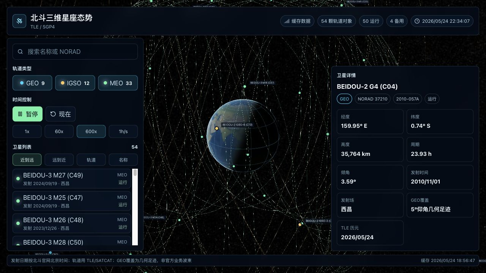

# BeiDou Earth Constellation

Interactive 3D BeiDou constellation visualization built with Vite, React, TypeScript, CesiumJS, and satellite.js.



## Features

- 3D Earth scene with BeiDou satellite positions, labels, and orbit tracks.
- Live SGP4 propagation from BeiDou TLE data.
- Satellite list with official Beijing launch dates, launch sites, orbit type filters, search, and sorting.
- Simulation controls for play/pause, speed, and returning to current time.
- CelesTrak online data with local snapshot fallback.

## Data Sources

- TLE: [CelesTrak BeiDou GP elements](https://celestrak.org/NORAD/elements/gp.php?GROUP=beidou&FORMAT=tle)
- SATCAT metadata: [CelesTrak SATCAT](https://celestrak.org/satcat/search.php)
- Launch dates: [BeiDou official website](http://www.beidou.gov.cn/)

## Run Locally

```bash
npm install
npm run dev
```

Open the local URL printed by Vite, usually `http://localhost:5173/`.

## Build

```bash
npm run build
npm run lint
```

## License

MIT
