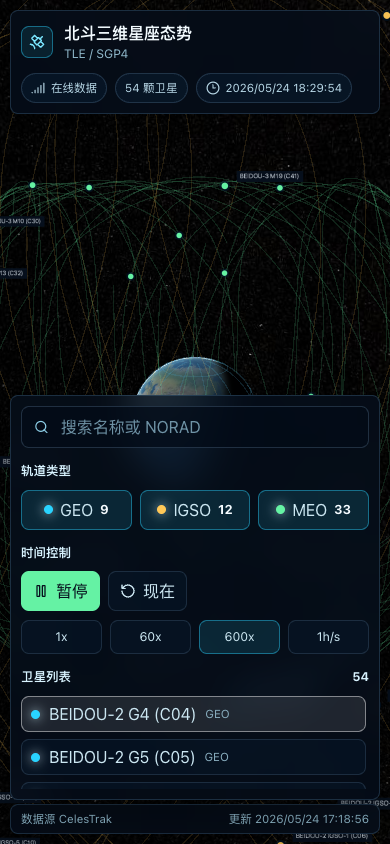

# BeiDou Earth Constellation

Interactive 3D BeiDou constellation visualization built with Vite, React, TypeScript, CesiumJS, and satellite.js.


## Features

- 3D Earth scene with BeiDou satellite positions, labels, and orbit tracks.
- Live SGP4 propagation from BeiDou TLE data.
- Satellite list with official Beijing launch dates, launch sites, orbit type filters, search, and sorting.
- Simulation controls for play/pause, speed, and returning to current time.
- CelesTrak online data with local snapshot fallback.

## Responsive Layout

The interface supports desktop and mobile viewports. On smaller screens, the status bar and controls stack over the full-screen Cesium scene while preserving the satellite list, filters, and playback controls.



## Data Sources

- Official public information: launch dates and constellation background are referenced from the [BeiDou Navigation Satellite System official website](http://www.beidou.gov.cn/).
- Public orbital data: TLE records are loaded from [CelesTrak BeiDou GP elements](https://celestrak.org/NORAD/elements/gp.php?GROUP=beidou&FORMAT=tle).
- Public catalog metadata: satellite catalog fields are loaded from [CelesTrak SATCAT](https://celestrak.org/satcat/search.php).
- Local snapshots: files under `public/data/` are cached public-data fallbacks for offline or network-failure scenarios.

## Run Locally

```bash
npm install
npm run dev
```

Open the local URL printed by Vite, usually `http://localhost:5173/`.

## Build

```bash
npm run build
npm run lint
```

## License

MIT
